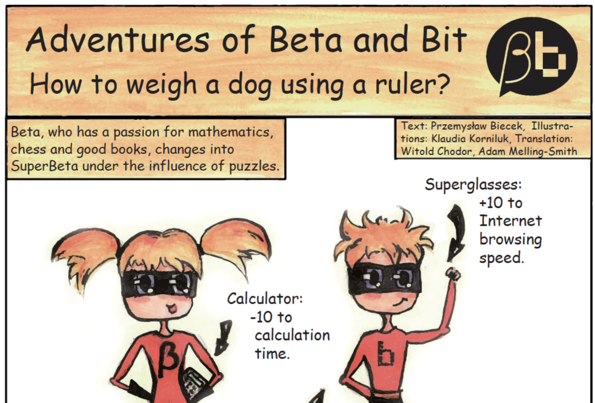
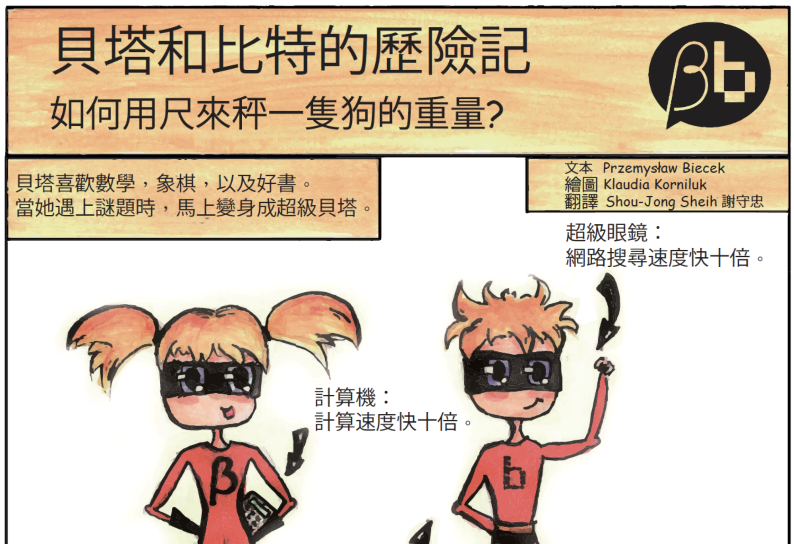
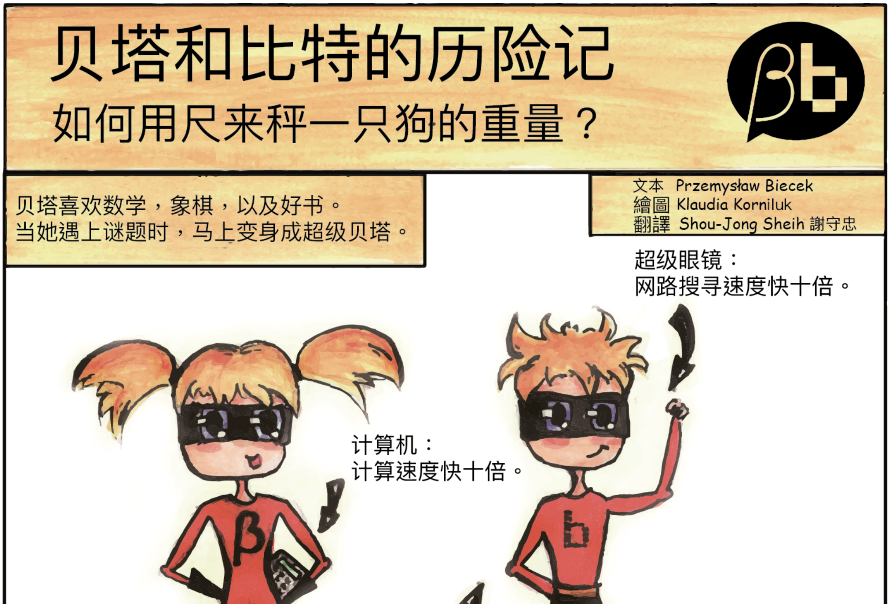
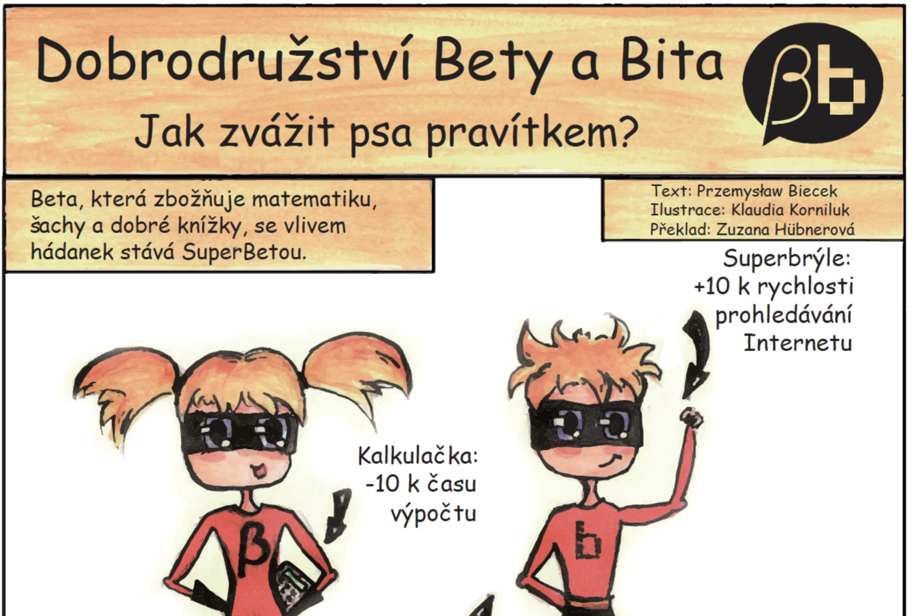
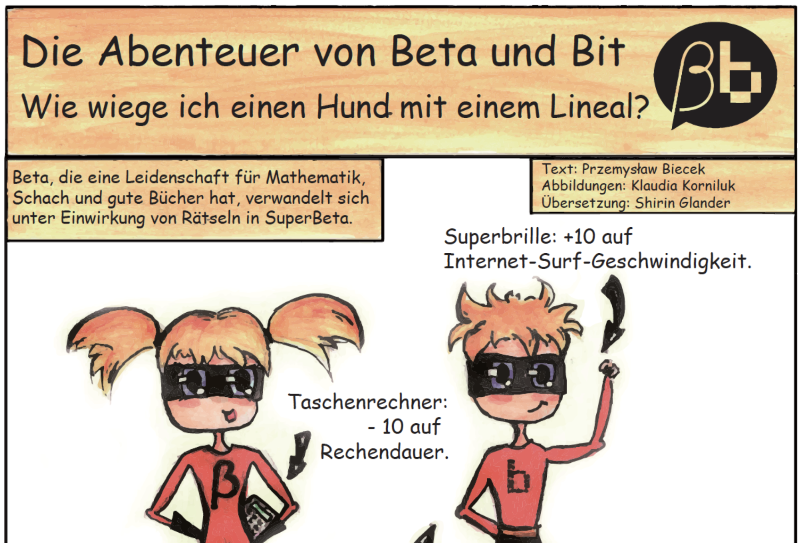
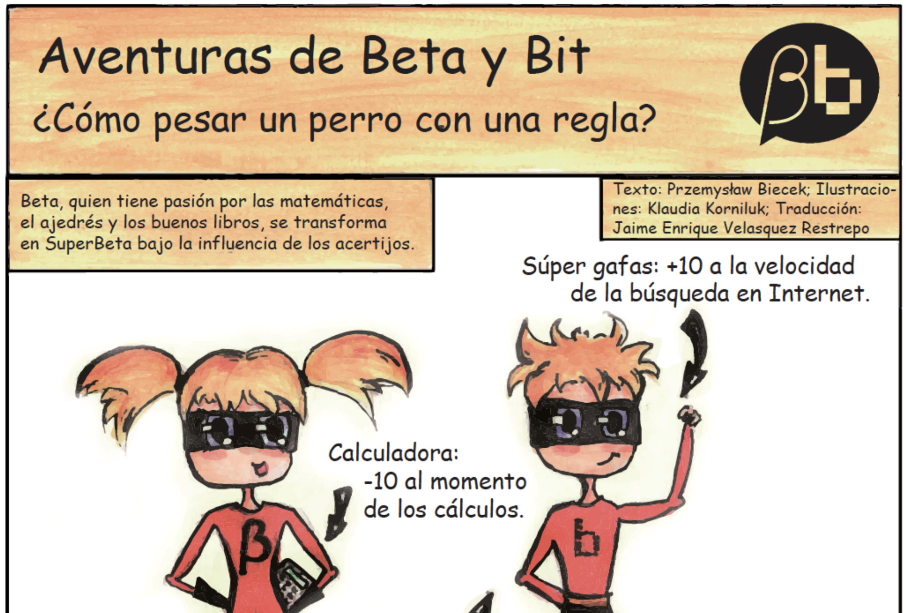
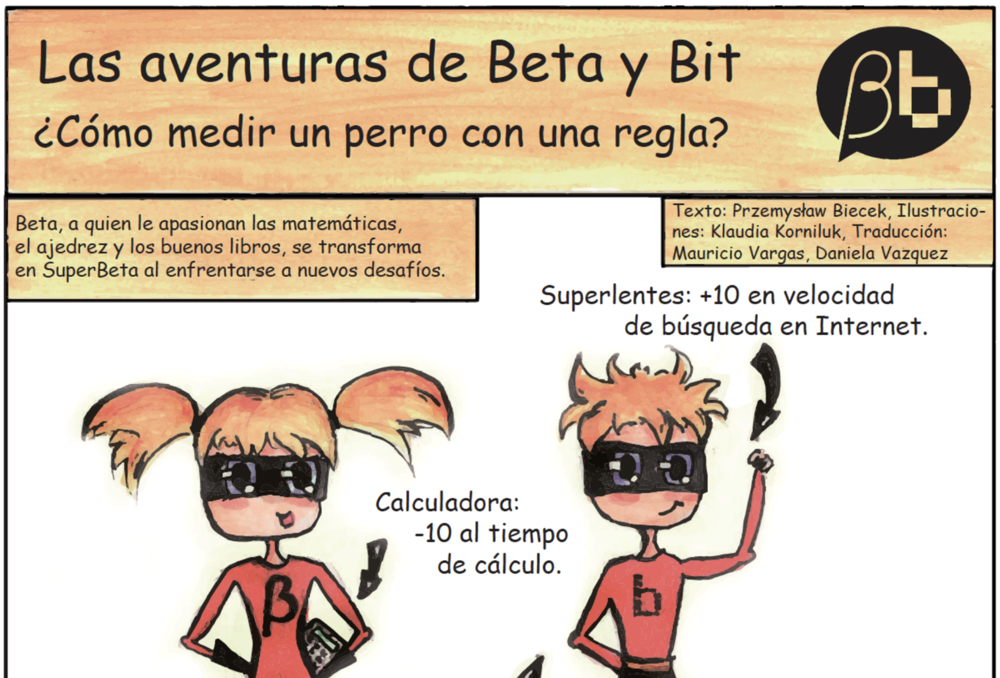
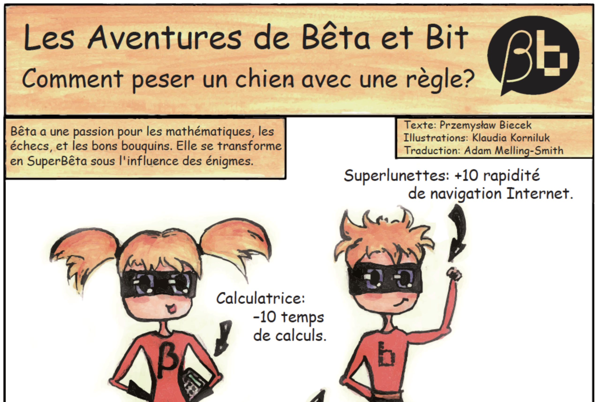
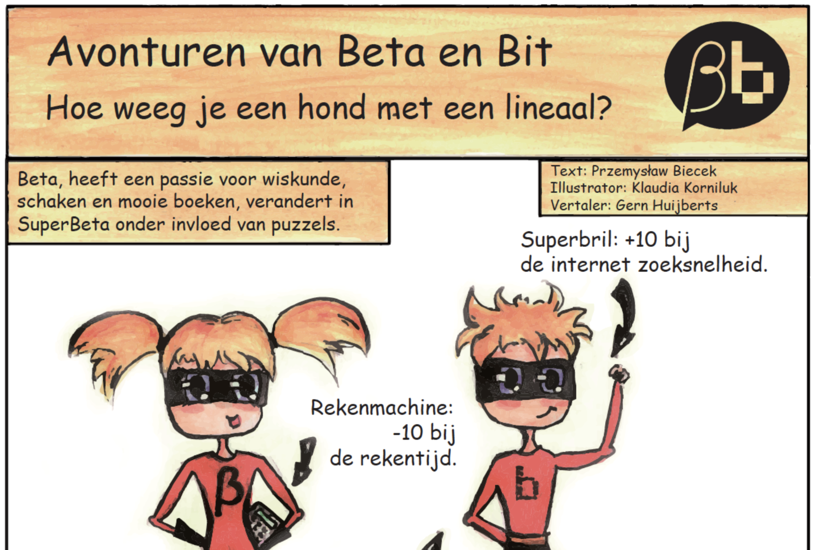

## How to weight a dog with a ruler?

Workshops for children 8-10 years old

_The Beta and Bit series_

*Beta:* skilled mathematician, well organized and very curious

*Bit:* hothead programmer, loves computers, robots and competitions

*Both:* team of data hackers, both loves adventures, puzzles and challenges

## Stories

### English

### Polish

### Chinese

### Simplified Chinese

### Czech

### German

### Spanish

### Spanish (Latin America) 

### French

### Dutch

### Vietnamese

